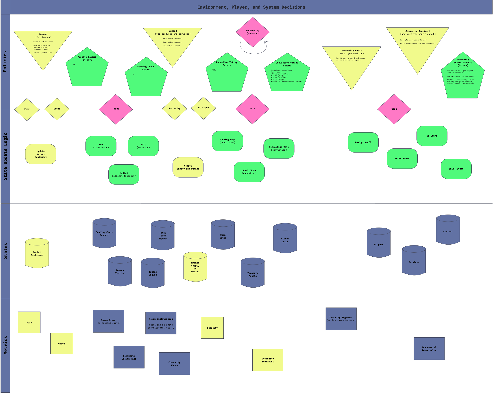

# Gardens cadCAD Sketch

> An exploration of [1Hive's Gardens template](https://forum.1hive.org/t/gardens-overview/32) following the [cadCAD design process](https://community.cadcad.org/t/putting-cadcad-in-context/19).

 

 

## Overview

**Gardens:** *community currencies with a voice*.

- Economic alignment via token collateralization.
- Anyone can permissionlessly enter and exit the org.
- Signal preferences instead of making hard decisions

[Gardens](https://github.com/1Hive/gardens-template) aim to support bottom-up grass roots coordination in decentralized networks. Anyone can come and go as they please. Members of the network can signal their preferences continuously.

Gardens is a social, financial, and technical foundation for online communities to organize. This empowers people to coordinate around causes, social movements, or even memes. Gardens are designed to be operationally decentralized and autonomous from day one. Based on our interpretation of the "[Hinman Test](https://www.lawandblockchain.eu/hinman-test/)" Gardens allow people to take advantage of tokenization while minimizing the risk of being designated as a security. Anyone can summon a Garden. The Garden summoner, however, does not have any special rights or authority within that community.

Gardens are composable! You can have a main Garden as the core of an ecosystem, but then also spin up derivative Gardens that use the tokens of the main DAO as the collateral/currency for the derivative DAOs. This creates an ecosystem of Gardens orgs that are connected to the main org (giving participants a stake in the ecosystem), but also allow each Garden to focus on it's own goals and use cases.

You can learn more about Gardens [here](https://forum.1hive.org/t/gardens-overview/32).

 

## Process

To start we're going to sketch out a [cadCAD differential specification](https://community.cadcad.org/t/differential-specification-syntax-key/31) for the Gardens system. There are (probably out of date) examples of the Gardens diff spec as `.png` and `.fig` files here in the README. You can view the latest version [here](https://www.figma.com/file/ioScpaacnmtmnjCgdq77KK/Gardens-Diff-Spec-detailed?node-id=0%3A1) on Figma.

Then we're going to select subsets of the system (such as the environment market sentiment model) to build independently. This has two benefits:

- First, we'll be able to ensure the the model works on it's own before adding in more complexity.
- Second, the models we build will also be able to be composed into other systems as well. This will (hopefully) benefit other cadCAD modelers as well as ourselves. Eventually this will create a library of components that anyone can pull off the shelf and combine to sketch out a model. Just like with software libraries, this will greatly reduce the time required to design and explore new cadCAD models.

 

## Market Sentiment Model

This is a simple model that cycles between optimism (greed) and pessimism (fear) on a regular basis. This signal could be used to inform agent decision in a larger model.

 
